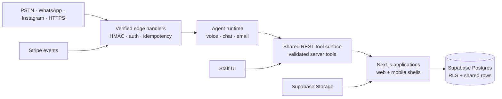

# System overview

The recurring architecture pattern across the work is a controlled path from external channels to agent tools, application surfaces and a shared data boundary.



## Boundary decisions

1. **Providers terminate at the edge.** Twilio, Meta, Stripe and other providers are adapted into internal event shapes before application logic runs.
2. **The model does not own side effects.** Agents call a narrow tool surface; authorization, validation and audit happen in application code.
3. **Retries are expected.** Provider webhooks are at-least-once, so event IDs and idempotency keys protect writes.
4. **Staff and agents use the same contracts.** A human operator should be able to reproduce or correct an agent action from the product UI.
5. **The database is the source of truth.** Search, analytics, notifications and provider integrations reconcile back to shared rows rather than maintaining separate hidden state.

## Typical request path

```text
channel → verified webhook → normalized event → authorized tool/service
        → database transaction → notification or provider response
```

The diagrams are intentionally provider-aware without exposing deployment URLs, credentials, customer data or private network topology.
